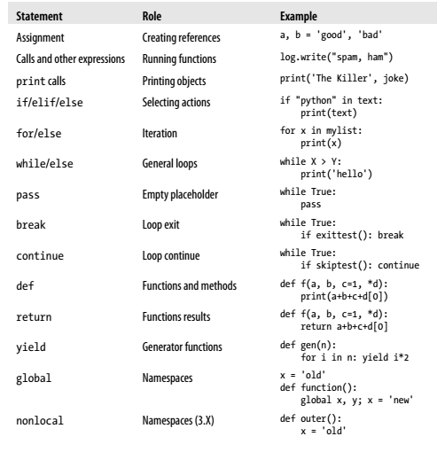
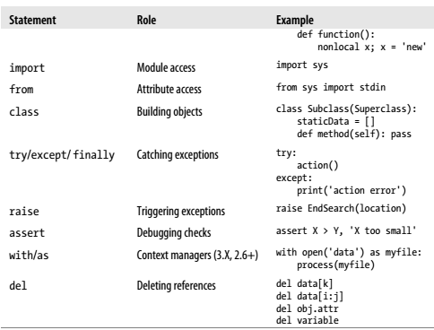
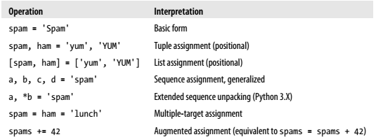

Title: Python Study Note (Last update: 2014-2-21)
Date: 2014-2-21 14:00
Category: Python
Tags: Python
Slug: Python Study Note
Author: we.taper
Summary: My Python Study Note.

#Python Study Note

##2014-02-17

**About Unicode**
*(python 3.3)*
When using `\xxx` to display Unicode characters, the encoding of the source file
also counts. e.g, if you type:

		s = '\xc4'
		print(s)
	
In a GBK based file, interpreter says:

		Error:
		UnicodeEncodeError: 'gbk' codec can't encode character '\xc4' in 
		position 2: illegal multibyte sequence
	
On the other hand, inside a UTF-8 file:

		'Ä'

**About Statements**
*Refer to: Page 320, Learning Python 5th, O'Reilly, ISBN: 978-1-449-35573-9*

**About ++/--**

In python, there is no ++/-- operator, see [Stack Overflow][s_o] and 
[Python IAQ][p_iaq] for more. 

However `++x` makes sense, which means `+(+(x))`,
so basically it's simply `x`.

[s_o]:http://stackoverflow.com/questions/3654830/why-are-there-no-and-operators-in-python
[p_iaq]:http://norvig.com/python-iaq.html

**About Assignment Statements**

*Refer to: Page 340, Learning Python 5th, O'Reilly, ISBN: 978-1-449-35573-9*

**Argumented Assignment, Performance**

If the subject is mutable and supports this operation, an augmented assignment 
may run even quicker by choosing an in-place update operation instead of an 
object copy. 

**About Divide and Mod**

See the difference of `3/10` and `3//10`. `/` means divide and result in decimal number, `//` means "mod" and results in integer. (A new feature in python 3)

##2014-02-26

**The strange loop:else**:

Try this code:

	x = 1
	while x < 3:
		x = int( input('Int(try > 3 and = 1):') )
		if x == 1:
			break
	else:
		print('Wow!')

And see this two article:[For/else](http://nedbatchelder.com/blog/201110/forelse.html),[python的while loop中的else多余吗？](http://bbs.csdn.net/topics/350231499)

The `else` will only be executed when `for` loop finishes normally or `while` loop is entered but not `break`ed.	

Python really wants to keep code simple.